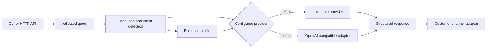

# Local Business AI Assistant

An open-source, mock-first Python framework for Indian micro and small businesses to answer common customer questions in English and simple Hinglish.

> **Project status: alpha MVP.** Local mode, CLI, HTTP API, configuration validation, tests, and one optional OpenAI-compatible adapter are implemented. WhatsApp, SMS, CRM, booking-provider sync, storage, authentication, and production deployment are not implemented.

## Why this exists

Small businesses often need a simple way to answer repeated questions about timings, location, services, booking, prices, and contact details. This project provides a low-cost foundation that works locally without an API key and exposes clean extension points for future messaging channels.

## What works today

- Validated JSON business profiles with name, description, address, hours, services, FAQs, booking link, and contact details.
- Deterministic local mode with no API key and no network request.
- English and basic Roman-script Hinglish detection and responses.
- Intent handling for timings, location, services, pricing, booking, contact, greetings, FAQs, and human escalation.
- Provider-neutral response interface.
- Optional OpenAI-compatible chat-completions adapter with explicit environment validation.
- CLI for one-off questions, configuration validation, and API startup.
- FastAPI endpoints: `GET /health` and `POST /v1/query`.
- Input length and schema validation.
- Metadata-only logs that avoid recording customer query text.
- Automated unit and API tests.

## Architecture



Channel integrations remain outside the core. See [architecture](docs/architecture.md) and [integration boundaries](docs/integrations.md).

## Requirements

- Python 3.10, 3.11, or 3.12
- Git for cloning
- No API key for local mode

## Install on Windows PowerShell

```powershell
git clone https://github.com/inceptionaistudios-beep/local-biz-ai-assistant.git
Set-Location local-biz-ai-assistant
py -3.12 -m venv .venv
.\.venv\Scripts\Activate.ps1
python -m pip install --upgrade pip
python -m pip install -e .
Copy-Item .env.example .env
```

If PowerShell blocks activation, you can run commands directly with `.\.venv\Scripts\python.exe` instead of changing execution policy.

## Install on macOS or Linux

```bash
git clone https://github.com/inceptionaistudios-beep/local-biz-ai-assistant.git
cd local-biz-ai-assistant
python3 -m venv .venv
source .venv/bin/activate
python -m pip install --upgrade pip
python -m pip install -e .
cp .env.example .env
```

## Configure a business

Copy [examples/business_profile.json](examples/business_profile.json), replace only the fictional sample values, and point `LOCAL_BIZ_PROFILE` to the new JSON file. Do not commit real customer data or private contact details.

Required profile fields:

| Field | Purpose |
| --- | --- |
| `name` | Public business name |
| `address` | Public customer-facing address |
| `hours` | Day or day-range to opening hours mapping |
| `services` | At least one supported service |

Optional fields include `description`, `faqs`, `booking_url`, `contact`, `currency`, and custom English/Hinglish escalation messages.

Validate before startup:

```powershell
local-biz-ai validate-config
```

## Use local mode

Local mode is the default and makes no external request.

```powershell
local-biz-ai ask "Aapki shop kab khuli hai?"
local-biz-ai ask "Where are you located?" --json
python app.py
```

Example structured response:

```json
{
  "answer": "Our opening hours are: Monday-Saturday: 09:00-21:00; Sunday: 10:00-18:00.",
  "intent": "timings",
  "language": "english",
  "provider": "local",
  "escalated": false,
  "request_id": "generated-request-id"
}
```

## Run the HTTP API

```powershell
local-biz-ai serve --host 127.0.0.1 --port 8000
```

Open API docs at `http://127.0.0.1:8000/docs`.

Health check:

```powershell
Invoke-RestMethod http://127.0.0.1:8000/health
```

Customer query:

```powershell
$body = @{ query = "Aap kahan located hain?"; language = "auto" } | ConvertTo-Json
Invoke-RestMethod -Method Post -Uri http://127.0.0.1:8000/v1/query -ContentType application/json -Body $body
```

Equivalent curl request:

```bash
curl -X POST http://127.0.0.1:8000/v1/query \
  -H "Content-Type: application/json" \
  -d '{"query":"What services do you offer?","language":"auto"}'
```

## Optional OpenAI-compatible provider

This adapter is implemented for APIs that expose a compatible `/chat/completions` endpoint. No specific commercial provider is certified by this project, and live credential-based integration tests are not included.

Set these only in your untracked `.env` file:

```dotenv
LOCAL_BIZ_PROVIDER=openai-compatible
LOCAL_BIZ_API_KEY=replace-locally
LOCAL_BIZ_API_BASE_URL=https://your-provider.example/v1
LOCAL_BIZ_MODEL=your-model-id
```

Rules:

- Non-local provider URLs must use HTTPS.
- Credentials, query strings, and fragments are rejected in the base URL.
- The API key is sent only in the authorization header and is never logged.
- A provider can still receive the customer query and configured business profile. Obtain appropriate consent and review the provider's privacy terms before use.
- Use `LOCAL_BIZ_PROVIDER=local` when external data sharing is not acceptable.

## Environment variables

| Variable | Default | Required |
| --- | --- | --- |
| `LOCAL_BIZ_PROVIDER` | `local` | No |
| `LOCAL_BIZ_PROFILE` | Packaged fictional demo profile | No |
| `LOCAL_BIZ_LOG_LEVEL` | `INFO` | No |
| `LOCAL_BIZ_REQUEST_TIMEOUT` | `15` | Remote mode only; range 1-60 |
| `LOCAL_BIZ_API_KEY` | none | Remote mode only |
| `LOCAL_BIZ_API_BASE_URL` | none | Remote mode only |
| `LOCAL_BIZ_MODEL` | none | Remote mode only |

## Development and testing

```powershell
python -m pip install -e ".[dev]"
python -m pytest
python -m ruff format --check .
python -m ruff check .
python -m mypy src
python -m build
python -m pip_audit .
```

CI runs tests on Python 3.10, 3.11, and 3.12 without private secrets.

## Repository structure

```text
.
|-- src/local_biz_ai_assistant/  # package, providers, CLI, and API
|-- tests/                       # unit and API tests
|-- examples/                    # fictional profiles and sample queries
|-- docs/                        # architecture, integrations, release, readiness
|-- .github/                     # CI, security, issue, and PR templates
|-- app.py                       # backward-compatible original entry point
|-- pyproject.toml               # package and tool configuration
`-- .env.example                 # placeholders only
```

## Security and privacy

- Keep `.env` local; it is ignored by Git.
- Never place secrets in business-profile JSON or customer requests.
- Local mode does not call external services.
- Logs record request ID, intent, language, provider, and escalation status; they do not intentionally record query text.
- This MVP has no authentication, rate limiting, conversation storage, or multi-tenant isolation. Do not expose it directly to the public internet.
- Review [SECURITY.md](SECURITY.md) before deployment or integration work.

## Limitations

- Hinglish support is a small keyword-based baseline, not full natural-language understanding.
- Local pricing responses do not invent a catalogue or price; they escalate for confirmation.
- FAQ matching is lightweight and deterministic.
- No WhatsApp, Meta Cloud API, Twilio, SMS gateway, CRM, booking-provider sync, database, analytics, authentication, or production deployment is included.
- Optional provider behavior depends on a third-party API and is not tested with paid credentials in CI.
- The default profile is fictional and must be replaced for real use.

## Roadmap and contributing

Completed work is tracked in [CHANGELOG.md](CHANGELOG.md); planned work is in [ROADMAP.md](ROADMAP.md). Contributions are welcome through [CONTRIBUTING.md](CONTRIBUTING.md). Please follow the [Code of Conduct](CODE_OF_CONDUCT.md).

## Maintainer

**Aarav Kumar Katiyar** — Founder, CEO, and Chief Developer of InceptionAIStudios.

Maintenance covers public issue triage, security review, documentation, test quality, and careful review of community pull requests. InceptionAIStudios private client work is separate from this public open-source project.

## License

MIT License. Copyright (c) 2026 Aarav Kumar Katiyar and InceptionAIStudios. See [LICENSE](LICENSE).
