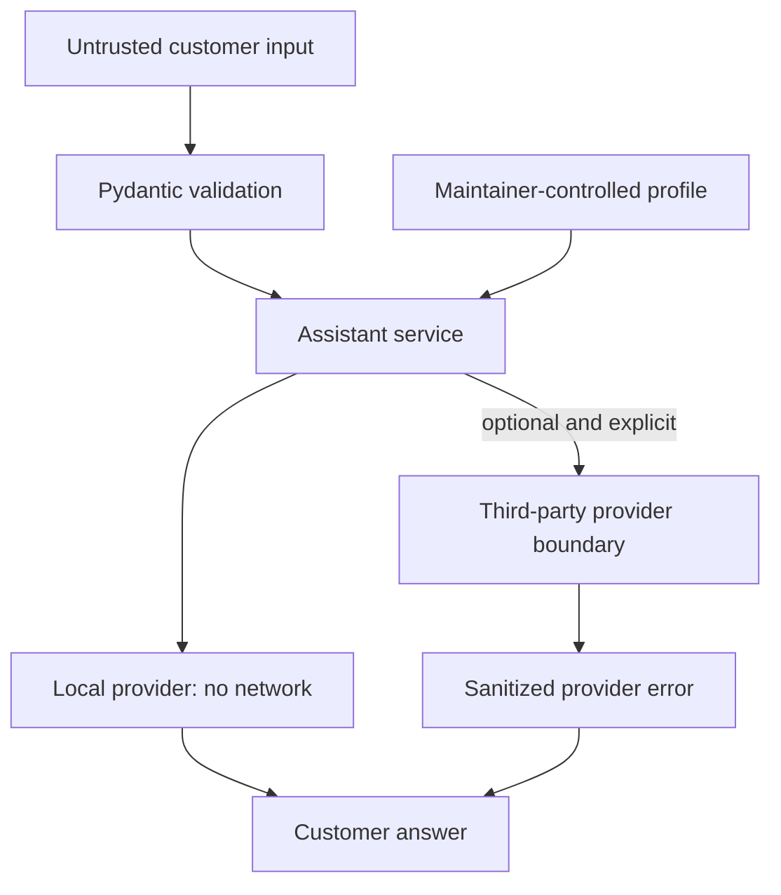

# Architecture

## Design goals

The MVP is intentionally small: it must work without paid credentials, keep business facts configurable, make unsupported questions explicit, and provide stable seams for future channels and model providers.

## Components

| Component | Responsibility |
| --- | --- |
| `models.py` | Validates business profiles, customer requests, responses, and health payloads. |
| `config.py` | Loads `.env` values and JSON profiles; enforces provider requirements and URL safety. |
| `intent.py` | Detects basic English/Hinglish language and supported intents; matches configured FAQs. |
| `providers.py` | Defines the provider protocol, deterministic local provider, and optional remote adapter. |
| `service.py` | Coordinates validation, routing, escalation, provider calls, and metadata-only logging. |
| `api.py` | Exposes FastAPI health and query endpoints. |
| `cli.py` | Exposes ask, validate, and serve commands. |

## Request flow

1. The CLI or HTTP API validates a non-blank query of at most 1,000 characters.
2. The service selects English or Hinglish, unless the caller explicitly chooses one.
3. A configured FAQ is matched before general intent handling.
4. The service creates a provider-neutral request with the validated business profile.
5. Local mode builds an answer only from configured data. Remote mode sends a restricted prompt to the explicitly configured endpoint.
6. The response includes intent, language, provider, escalation status, and request ID.
7. Logging records response metadata but not the customer query.

## Trust boundaries

Environment configuration is trusted operator input, but it is still validated. Provider base URLs cannot contain credentials, query strings, or fragments. Plain HTTP is accepted only for localhost development.

## Extension rules

- New providers implement `ResponseProvider` and return customer-safe text.
- New channel adapters should translate transport payloads into `QueryRequest` and map `AssistantResponse` back to the channel.
- Core business logic must not import a specific messaging SDK.
- Channel signature verification and replay protection belong at the adapter boundary.
- Storage must be opt-in, minimize data, define retention, and avoid query text in ordinary logs.

## Known architecture limits

The in-process service has no dependency injection container, queue, database, cache, authentication, rate limiting, multi-tenancy, or distributed tracing. Those are deliberate MVP omissions, not hidden capabilities.
